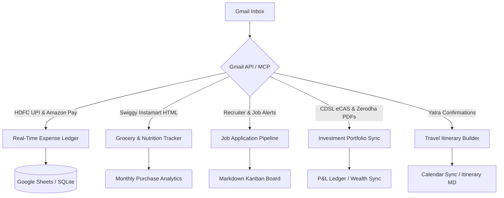

# Possible Gmail Automations

We analyzed the last month of Gmail data (from **2026-05-10** to **2026-06-10**) using the Gmail MCP server. The mailbox contains a high volume of transactional alerts, job hunt updates, investment statements, and services communications. Below is a detailed analysis of the email patterns discovered and five concrete automation blueprints we can build.

---

## 1. Inbox Analysis Findings

Our search for the last 30 days of data revealed distinct clusters of high-frequency and highly structured emails:

| Category | Typical Senders | Key Data Extracted | Frequency / Volume |
| :--- | :--- | :--- | :--- |
| **UPI Transactions** | `alerts@hdfcbank.bank.in` (HDFC InstaAlerts) | Debited amount, account end-digits, VPA address, merchant name, timestamp, ref number | **Very High** (multiple per day) |
| **Merchant Payments** | `no-reply@amazonpay.in` | Merchant name, status (Approved/Declined), exact amount, payment date | **High** |
| **Grocery Delivery** | `noreply@instamart.in` (Swiggy Instamart) | Itemized list of products (with price/quantity), handling fees, grand total, delivery address | **Frequent** |
| **Job Applications** | LinkedIn Jobs, Naukri Alerts, Arc, Built In, direct recruiter emails (`@6sense.com`, `@moniepoint.com`, etc.) | Company name, job title, application status (Applied, Interview, Rejected), sender details | **High** |
| **Investment Logs** | `eCAS@cdslstatement.com`, `services@cdslindia.co.in` (CDSL), Zerodha reports, NSE alerts | Consolidated portfolios, trade confirmations, margin statements, equity contract notes | **Daily/Monthly** |
| **Travel & Flights** | `donotreply@yatra.com` (Yatra) | Flight updates, PNR, flight number, itinerary details | **Occasional** |

---

## 2. Recommended Automation Blueprints

Based on these findings, we can build the following five automations. Each is designed to run locally, protecting financial/personal privacy while structuring your data.



---

### Blueprint 1: Real-Time UPI & Expense Ledger
Automatically log all UPI debits and merchant payments to a central expense log.

*   **How it works**:
    1.  A script filters daily for `from:alerts@hdfcbank.bank.in` with subjects containing `"UPI txn"` and `from:no-reply@amazonpay.in`.
    2.  An regex/HTML-parser extracts details:
        *   *HDFC alert text*: `"Rs.58.00 is debited from your account... towards VPA Q838293821@ybl (RFA Hypermarket Yelehanka new town)"`
        *   *Amazon Pay text*: `"Your payment of ₹ 255.0 to SWIGGY BUSINESS was successful"`
    3.  A lightweight LLM call or rule-based parser categorizes the merchant (e.g., "RFA Hypermarket" $\rightarrow$ "Groceries", "SWIGGY BUSINESS" $\rightarrow$ "Food Delivery").
    4.  Appends the data to a local SQLite database or Google Sheet.
*   **Why it's cool**: Completely bypasses manual expense logging apps. You get a unified transaction sheet directly from your bank and payment gateway emails.

---

### Blueprint 2: Granular Grocery & Nutrition Dashboard (Swiggy Instamart)
Track exactly what groceries you purchase, analyze pricing trends, and maintain a consumption list.

*   **How it works**:
    1.  Monitor emails from `noreply@instamart.in` with the subject `"Your Instamart order was successfully delivered"`.
    2.  Extract the raw HTML body. Swiggy emails contain highly structured tables of ordered items:
        ```html
        1 x Yelakki Banana (Baalehannu) - ₹49.00
        1 x English Oven Sandwich Bread - ₹55.00
        1 x Nandini Shubham Milk - ₹27.00
        1 x Fresh Eggs White eggs - ₹104.00
        ```
    3.  Parse individual items, unit prices, and quantities.
    4.  Save itemized data to a JSON database.
*   **Why it's cool**: Offers deep insights into your grocery spending. You can track inflation on specific food items (e.g., how the price of milk or eggs changes over months) and estimate nutritional intake/stock levels.

---

### Blueprint 3: Smart Job Application & Interview Pipeline
Track your job hunt progress automatically by monitoring job portal alerts and recruiter communications.

*   **How it works**:
    1.  Create a parser targeting portals (LinkedIn, Naukri, Glassdoor, Arc) and direct candidate emails.
    2.  Classify emails into three states:
        *   **Applied**: Confirmation emails (e.g., `Ejaz, your application was sent to Chargebee`).
        *   **Interview**: Scheduling emails (e.g., `Moniepoint Interview Invitation for Senior Product Analytics` or `TCS Interview || Data Analyst`).
        *   **Rejection / Update**: Portals indicating a status change.
    3.  The parser extracts: **Company Name**, **Job Title**, **Date**, **Contact Sender**, and **Current Status**.
    4.  Updates a local markdown Kanban board (`job_hunt_tracker.md`) or a Notion database.
*   **Why it's cool**: Eliminates the chore of updating job trackers. Your application funnel, interview dates, and recruiter contact info stay organized in one dashboard.

---

### Blueprint 4: Investment Portfolio Sync (CDSL & Zerodha)
Consolidate your stock and mutual fund investments using depository CAS and broker contract notes.

*   **How it works**:
    1.  Identify emails from `eCAS@cdslstatement.com` (CDSL CAS) or Zerodha (`no-reply-contract-notes@reportsmailer.zerodha.net`).
    2.  Download the attached PDF statement (e.g., `CDSL Consolidated Account Statement (CAS)...-MAY2026.pdf`).
    3.  Execute a local Python script utilizing the **`casparser`** library (for CDSL/CAMS) or **`pdfplumber`** (for Zerodha contract notes).
    4.  Use your PAN (in uppercase) to decrypt the PDFs securely in memory.
    5.  Extract portfolio values, mutual fund units, and executed stock transactions, then sync them to a local portfolio database.
*   **Why it's cool**: Gives you a local, private way to calculate net worth, portfolio allocation, and capital gains without exposing your PAN and financial history to third-party tracking websites.

---

### Blueprint 5: Automated Travel Itinerary Builder
Extract and organize travel bookings into a clean travel dashboard.

*   **How it works**:
    1.  Monitor emails from `donotreply@yatra.com`, airlines, or hotels.
    2.  Extract itinerary components: PNR, Flight Number, Departure Time, Seat Number, Hotel Address.
    3.  Generate an itinerary markdown file (e.g., `trip_bengaluru_june_2026.md`) and automatically add calendar events to your local calendar (.ics file or via API).
*   **Why it's cool**: Collects fragmented travel emails into a single, clean timeline containing everything you need on travel day.

---

## 3. Recommended Implementation Roadmap

If you would like to proceed with building these automations, we recommend a phased approach:

### Phase 1: Setup a Core Gmail Fetching Utility
*   Create a local python daemon using your existing `gmail` server setup to fetch and label new emails daily.
*   Establish a safe directory structure to download and archive statement PDFs (similar to your `Airtel Axis Statements` pattern).

### Phase 2: Implement the Expense & Grocery Parsers (Blueprints 1 & 2)
*   Since UPI alerts and Instamart emails are highly structured, we can write robust, regex-based and HTML-based parsers to log data into a local SQLite database.
*   Design a simple command-line interface or dashboard to display weekly spending.

### Phase 3: Implement the Job Tracker & Investment Parsers (Blueprints 3 & 4)
*   Integrate the local `casparser` library to process PDF statements.
*   Deploy a lightweight AI classifier to organize incoming job notifications and build/update the job board.
